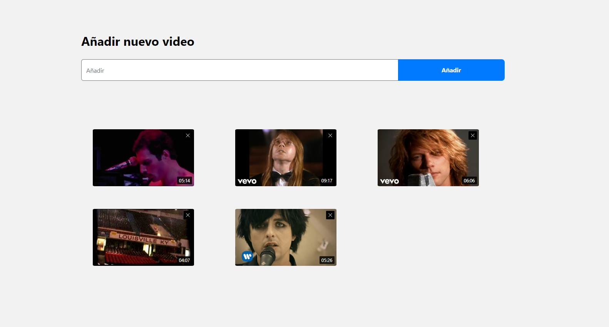
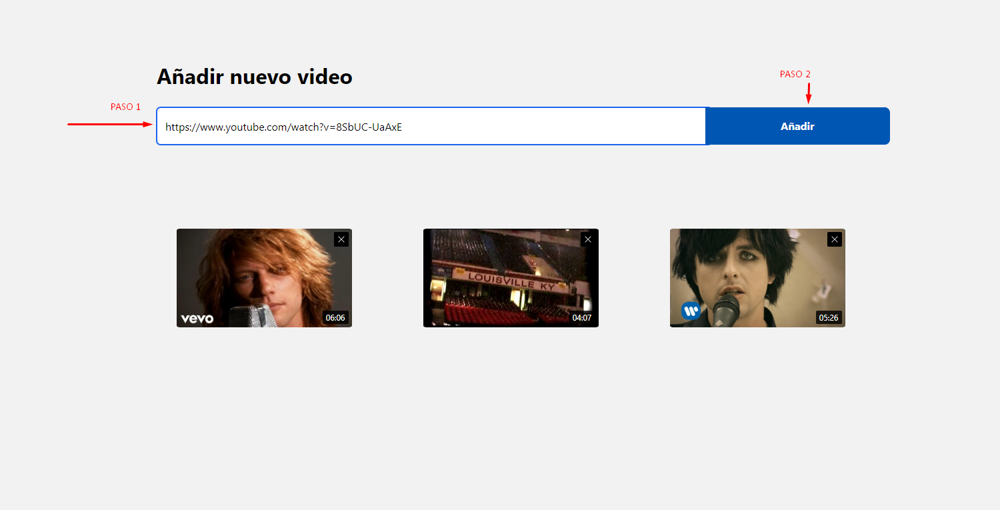
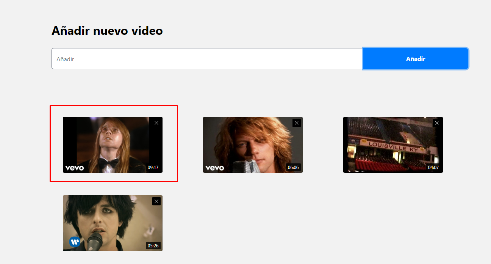
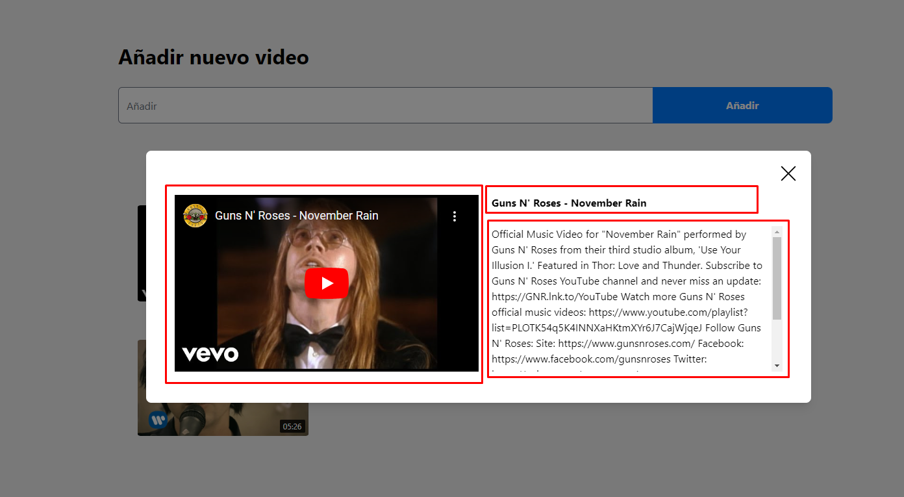
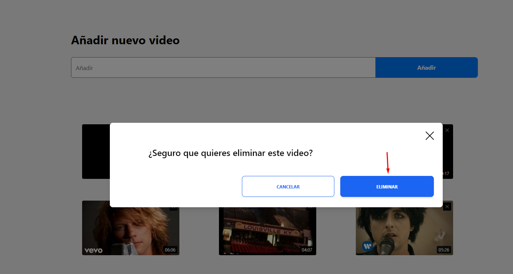
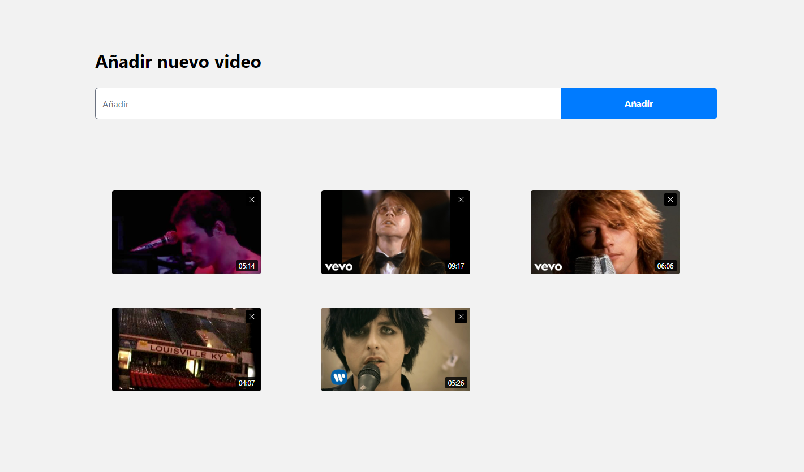
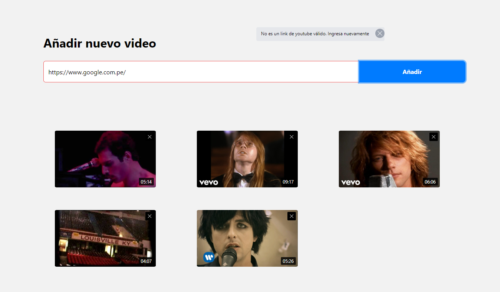
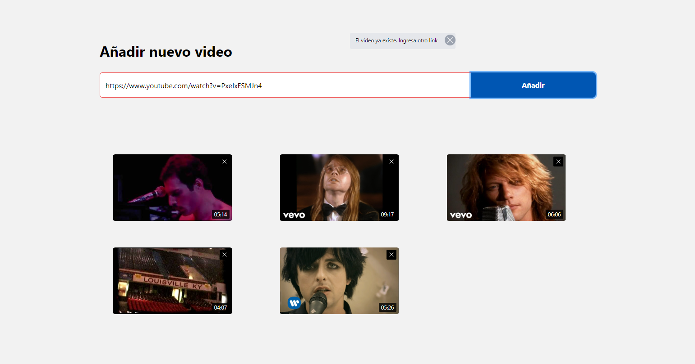

# PROCESADOR DE VIDEOS DE YOUTUBE

Esta aplicación fue desarrollada como parte del examen técnico para AFEX. Utiliza las siguientes tecnologías:

- React v18.2.0 (con native hooks y custom hooks)
- Node.js v20.11
- MongoDB
- GCP como servidor

## Requisitos previos
Asegúrate de tener instalado NPM y un editor de código si deseas realizar modificaciones.

## Instalación de paquetes
Se necesitan las dependencias de React y Node. En la terminal, ejecuta el siguiente comando en la raíz del proyecto:

```bash
$ npm install
```

## Cómo correr el proyecto

* ### Demo

    Si estás utilizando la demo, visita [www.example.com](www.example.com).

* ### Local
    Estos pasos te permitirán tener la aplicación en tu local.

1. Clona el proyecto desde su repositorio [aquí](https://github.com/AndersonBH16/afex-album-api-youtube).

   Vía HTTPS:
   ```bash
   $ git clone https://github.com/AndersonBH16/afex-album-api-youtube.git
   ````
2. Instala las dependencias:

    ```bash
    $ npm install
    ```

3. Modifica los accesos correspondientes a la base de datos.

## Funcionamiento de la aplicación

### Localhost

Si estás utilizando `localhost`:

1. **Vista de la aplicación**
    

2. **Insertar un video**
    * Se debe insertar un link en el input tal cual se muestra en la imagen debajo y luego presionar el botón Añadir:

    

    * El video se visualizará automáticamente el panel inferior añadiéndose justo al inicio de la galería de videos.

    

3. **Visualizar un video**
    * Hacer click sobre la imagen de cualquier video en la lista, posteriormente se abrirá un modal con el video y la información:
    

4. **Eliminar un video**
    * Para eliminar un video se debe hacer click en la esquina superior derecha de cada video. 
   
   * Posteriormente se abrirá una ventana de diálogo y hacer click en el boton eliminar.
   
   * El video eliminado desaparece de la lista
   

5. **Validar si el link ingresado es correcto**
        
    La aplicación está validada de tal manera que sólo admita videos de links válidos de **youtube.com** o **youtu.be**

    

    También verifica si el video que se dea añadir ya existe
    

## Acerca de

Desarrollado por
**Anderson Blas** - 2024 - para **AFEX**

¡Gracias por utilizar el Procesador de Videos de YouTube! Si tienes alguna pregunta o problema, no dudes en ponerte en contacto con el desarrollador: [ander.bh.16@gmail.com](mailto:correo@example.com).

